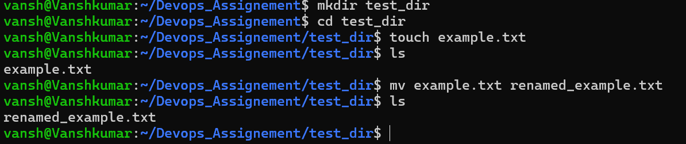
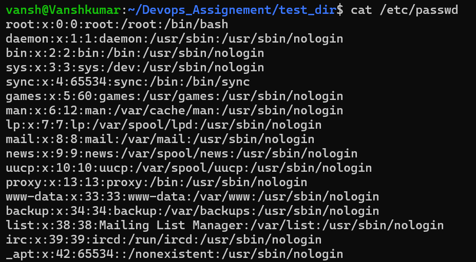
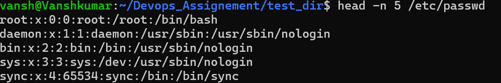
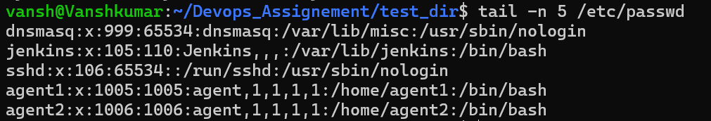
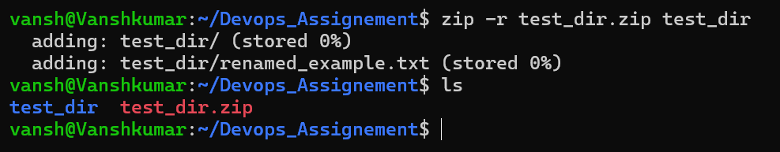
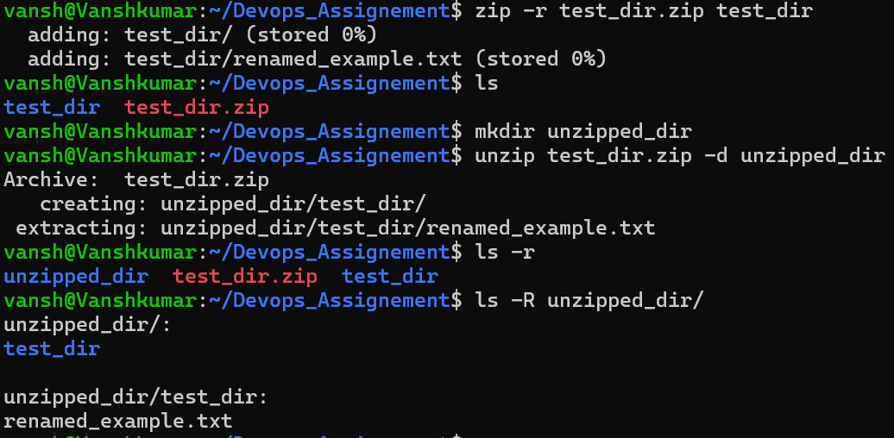
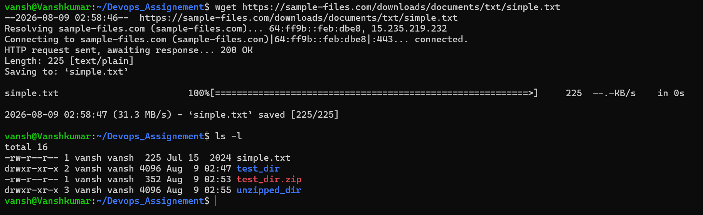
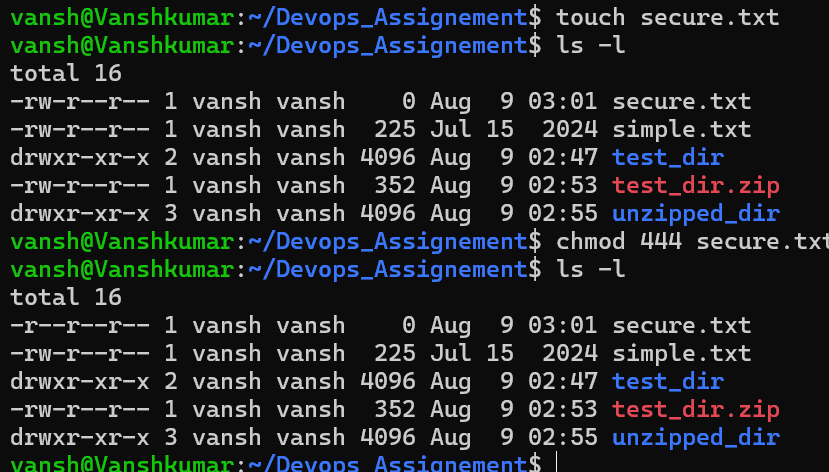
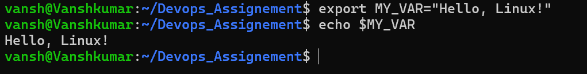

# Assignment 1 — Linux Command-Line Practical Assignment

## Overview

This assignment demonstrates basic Linux command-line operations for file management, file viewing, searching, compression, downloading, permissions, and environment variables.

---

## 1. Creating and Renaming Files/Directories

### Create Directory

```bash
mkdir test_dir
```

**Explanation:**
Creates a directory named `test_dir`.

**Screenshot:**


---

### Create an Empty File

```bash
cd test_dir
touch example.txt
```

**Explanation:**
`cd` enters the `test_dir` directory, while `touch` creates an empty `example.txt` file.


### Rename the File

```bash
mv example.txt renamed_example.txt
```

**Explanation:**
Renames `example.txt` to `renamed_example.txt`.

---

## 2. Viewing File Contents

### Display `/etc/passwd`

```bash
cat /etc/passwd
```

**Explanation:**
Displays the complete contents of the `/etc/passwd` file.

**Screenshot:**


---

### Display First 5 Lines

```bash
head -n 5 /etc/passwd
```

**Explanation:**
Displays only the first five lines of `/etc/passwd`.

**Screenshot:**



---

### Display Last 5 Lines

```bash
tail -n 5 /etc/passwd
```

**Explanation:**
Displays only the last five lines of `/etc/passwd`.

**Screenshot:**



---

## 3. Searching for Patterns

### Search for `root`

```bash
grep "root" /etc/passwd
```

**Explanation:**
Searches `/etc/passwd` and displays every line containing the word `root`.

**Screenshot:**


---

## 4. Zipping and Unzipping

### Compress `test_dir`

Run this from the directory containing `test_dir`:

```bash
zip -r test_dir.zip test_dir
```

**Explanation:**
Creates a ZIP archive named `test_dir.zip` containing `test_dir` and its contents.

**Screenshot:**



---

### Create Extraction Directory

```bash
mkdir unzipped_dir
```

**Explanation:**
Creates a directory named `unzipped_dir` to store the extracted files.

**Screenshot:**



---

### Extract the ZIP File

```bash
unzip test_dir.zip -d unzipped_dir
```

**Explanation:**
Extracts `test_dir.zip` into the `unzipped_dir` directory.


---

## 5. Downloading Files

### Download a File Using `wget`

```bash
wget https://example.com/sample.txt
```

**Explanation:**
`wget` downloads a file from the specified URL.

**Screenshot:**


---

## 6. Changing File Permissions

### Create `secure.txt`

```bash
touch secure.txt
```

**Explanation:**
Creates an empty file named `secure.txt`.


---

### Make the File Read-Only

```bash
chmod 444 secure.txt
```

**Explanation:**
Changes the permissions so the owner, group, and others have read-only access.

---

### Verify Permissions

```bash
ls -l secure.txt
```

**Expected permission:**

```text
-r--r--r--
```

**Screenshot:**



---

## 7. Working with Environment Variables

### Set `MY_VAR`

```bash
export MY_VAR="Hello, Linux!"
```

**Explanation:**
Creates an environment variable named `MY_VAR` with the value `Hello, Linux!`.

---

### Verify the Variable

```bash
echo $MY_VAR
```

**Expected output:**

```text
Hello, Linux!
```

**Screenshot:**



---

## Conclusion

This assignment demonstrates fundamental Linux commands used for file management, text processing, compression, downloading, permissions, and environment variables.


