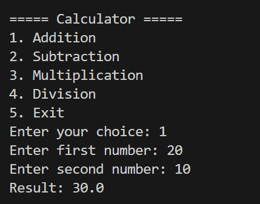
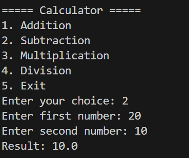
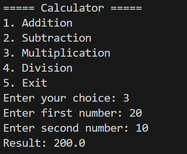
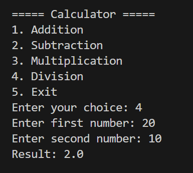
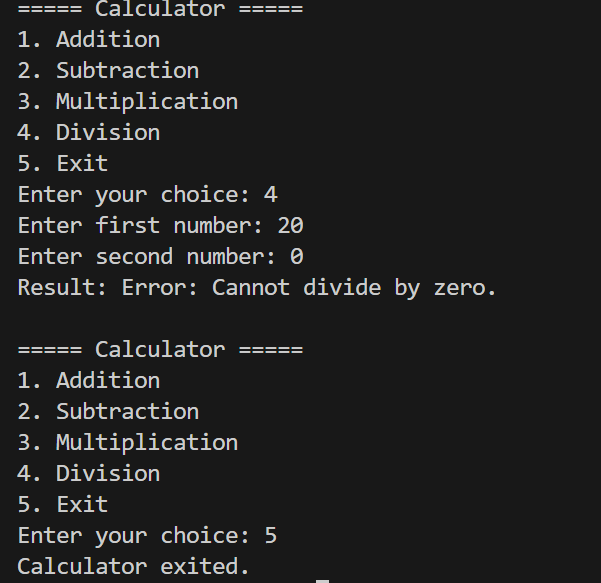

# Assignment 2 — Menu-Driven Calculator

## Functions

- `add(x, y)` — adds two numbers.
- `subtract(x, y)` — subtracts the second number from the first.
- `multiply(x, y)` — multiplies two numbers.
- `divide(x, y)` — checks for a zero divisor before dividing.

## Code Explanation
It use infinity loop using `while True` it keep on executing until user select the option which have `break` statement which is use to exit from the loop

To determine the Menu option execute proper operation we use the `if -elif-else` based on choise that perticular condition come true then it execute the operation 

for `division ` we check the **denominator** if it is equal to zero show the user `Please Enter Number Greater than 0 `

>Here are some example 

### Addition

```text
Enter your choice: 1
Enter first number: 20
Enter second number: 10
Result: 30.0
```

### Subtraction

```text
Enter your choice: 2
Enter first number: 20
Enter second number: 10
Result: 10.0
```



### Multiplication

```text
Enter your choice: 3
Enter first number: 20
Enter second number: 10
Result: 200.0
```

### Division

```text
Enter your choice: 4
Enter first number: 20
Enter second number: 10
Result: 2.0
```





### Division by Zero

```text
Enter your choice: 4
Enter first number: 20
Enter second number: 0
Result: Error: Cannot divide by zero.
```



## GitHub Repo
[Assinment-2 ](https://github.com/vanshkumar31/tutedude/tree/main/Assignment-2)